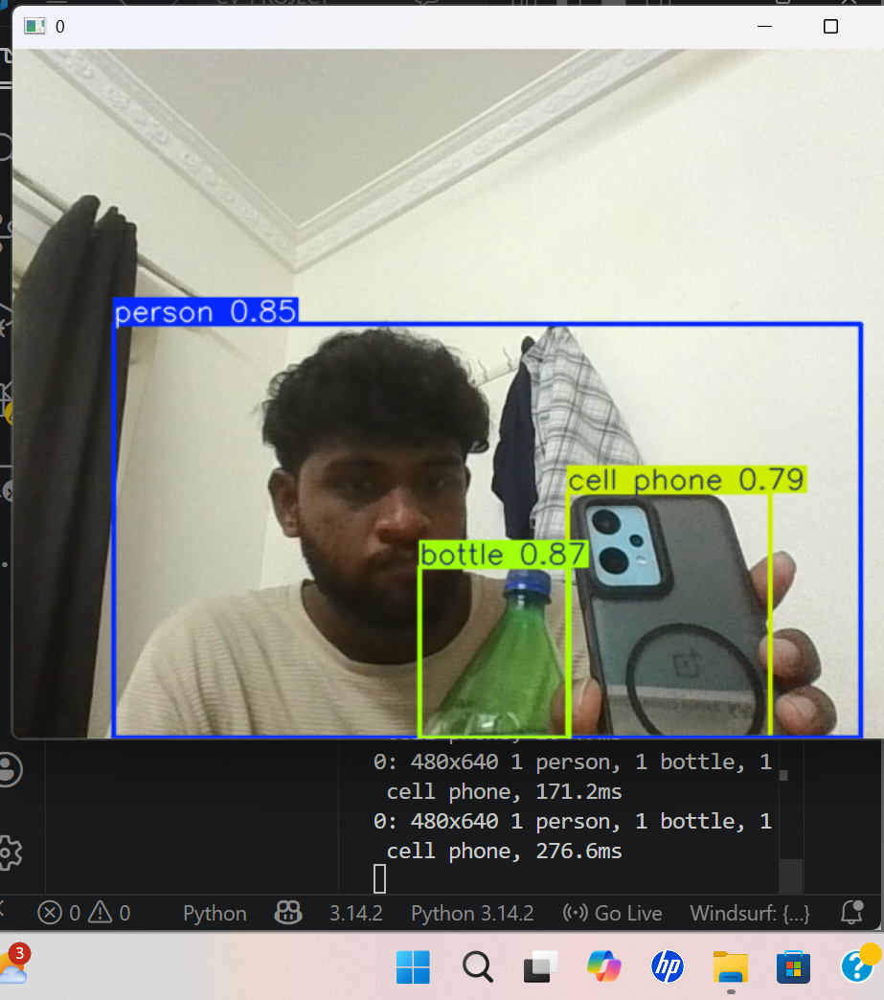

# Real-Time Object Detection System (YOLOv8)

## 📌 Overview
This project implements a real-time object detection system using YOLOv8 and OpenCV.  
It can detect multiple objects from live webcam streams and display bounding boxes with class labels.

---

## 🚀 Features
- Real-time object detection using webcam
- Detects multiple objects simultaneously
- Displays bounding boxes with confidence scores
- Saves output video automatically
- Lightweight and fast inference using YOLOv8

---

## 🛠️ Tech Stack
- Python
- OpenCV
- YOLOv8 (Ultralytics)
- PyTorch

---

## 📸 Output


---

## 🎯 Use Case
This system can be used in:
- Retail product detection & shelf monitoring
- Inventory management
- Smart surveillance systems
- Traffic & crowd analysis

---

## ⚙️ How to Run

### 1. Install dependencies
```bash
pip install ultralytics opencv-python